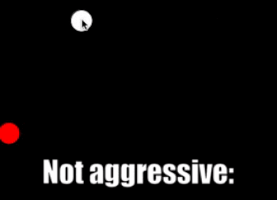
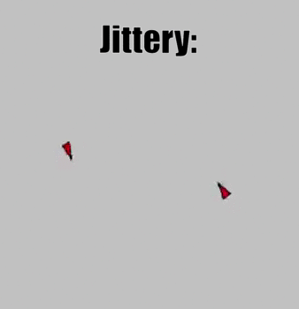
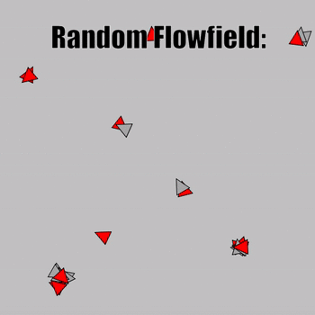
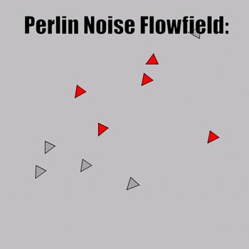
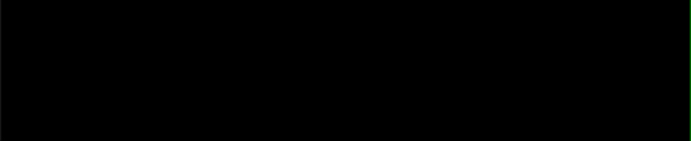

# ASSIGNMENT 6: AGGRESSIVENESS ASSOCIATION

For this assignment, we were told to implement a function that makes grey vehicles avoid the red vehicles, in the fear that they may be aggressive.

## PROCESS

Because Professor did not upload the code onto the Lecture Notes when I first tested it out, i thought that we either had to create a static code or a simple code depicting this avoidance of the red vehicles. i started off with a white ball moving according to the mouse coordinates, and a red ball going from left to right, changing aggressiveness depending on the random number of 0 or 1.

If the red ball was aggressive, if the white ball got too close to the red ball, the whole program would stop looping, as seen in the 

## PROBLEMS

### 1. SKEWED LINE

Even when I understood everything going on, the red line (representing the scalar projection) was skewed to the right instead of on the black line.

I did my best to correct this by changing my coordinates to start on the edge of the screen instead. Interestingly, this solves the problem, which I infer came from the dot product. Because changing the coordinates to 0 made the lines collide with the canvas, I translated it accordingly for a cleaner look.

### 2. INACCURATE ANGLE

Using the knowledge I gained from watching the videos and reading the book, I was able to create a working diagram similar to what Professor demonstrated in class! Here are is what it looks like as a non-static (setup and draw present) code, where  I also included in this week's directory. Because I was also curious if it was as accurate as it looks, I attempted to print the angle between the red line (scalar projection) and the moving line. Though working, it was not as accurate as I would have liked. It did not show 0 when the red and black line intersect.

