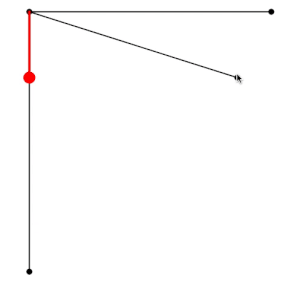
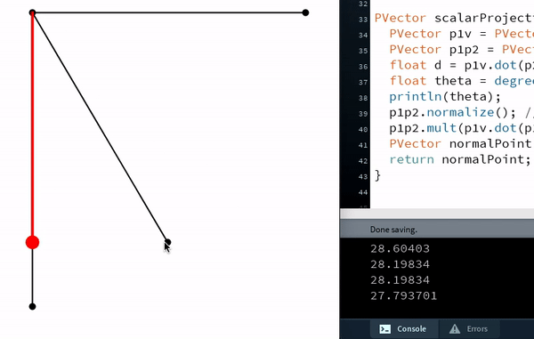

# ASSIGNMENT 5: SCALAR PROJECTION OF ANGLES

Finding the scalar projection of the angle was harder than what I thought it would be, as I am not very good at Trigonometry myself.

## PROCESS

I first started off with the code Professor showed in class, and translated it into a non-static program to test it out. However, I did not understand the components of the code, so I decided to read the Nature of Code book, as well as watch its accompanying videos.

## PROBLEMS

Even when I understood everything going on, the red line (representing the scalar projection) was skewed to the right instead of on the black line. I did my best to correct this.

## RESULT

Using the knowledge I gained from watching the videos and reading the book, I was able to create a working diagram similar to what Professor demonstrated in class! Here are is what it looks like as a non-static (setup and draw present) code, where  I also included in this week's directory:

Because I was also curious if it was as accurate as it looks, I attempted to print the angle between the red line (scalar projection) and the moving line. Though working, it was not as accurate as I would have liked. It did not show 0 when the red and black line intersect.

# DISCUSSION QUESTIONS

## 1. PROGRAMMING DEVIANCY
Is it possible to program deviancy on a machine? In the story "Robbie", the father of Gloria says how the machine's entire "mentality" has been created for the purpose of being a companion to the child. As a result, the machine can't help but be faithful and loving and kind. With this being said, why are there still many fears of machines approaching deviancy, if such a feature is not programmed into them in the first place?

## 2. A CULTURE WITH ROBOTS
In the story "Robbie", little girl Gloria recognizes Robbie as a person instead of a machine, like her mother and father recognize him. This may be, not only due to Robbie looking like a human, but due to Robbie being around since her childhood, and this growing up to be her norm. Much like how people are more aware when they grow up with different cultures, if our future generations grow up where machines are the norm, will we start seeing them as humans too?

## 3. SAFETY OF CHILDREN IN THE HANDS OF AI
Though the argument made by Gloria's mother in the story "Robbie" is unethical due to her not wanting her child's only friend to be a machine, I can see why a parent would be cautious of letting a controlled machine care for their child. As an example, I have read numerous articles where a child's speaker system was hacked into by predators and tried speaking to them. What ensures that the same thing will not happen with machines in the future?

## 4. COLLISION OF DUTIES OF MACHINES
In the story "Runaround", Donovan and Powell find out that the reason Speedy, their machine, wasn't returning was due to a conflict/collision of the rules he was programmed to follow. How precise do the rules given to the machines have to be to ensure that no such collision takes place? Is this inevitable?

## 5. EXCEPTIONS FOR DEVIANCY
In what circumstances should a machine be able to deviate from their said duties for the sake of the safety of their owner or those around them? As an example, should a dog-walking robot save an elderly woman if it detects a speeding car on the road? Does adding these features for such circumstances increase the risk of deviancy, as it requires a tinge of human emotion?
