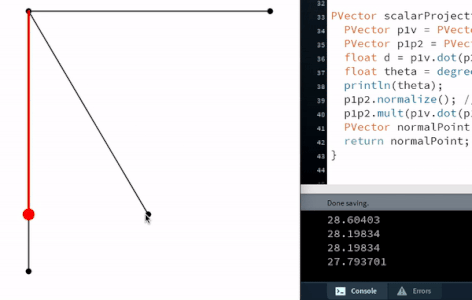

# ASSIGNMENT 5: SCALAR PROJECTION OF ANGLES

Finding the scalar projection of the angle was harder than what I thought it would be, as I am not very good at Trigonometry myself.

## PROCESS

I first started off with the code Professor showed in class, and translated it into a non-static program to test it out. However, I did not understand the components of the code, so I decided to read the Nature of Code book, as well as watch its accompanying videos. This may have caused 

# DISCUSSION QUESTIONS

1. Is it possible to program deviancy on a machine? In the story "Robbie", the father of Gloria says how the machine's entire "mentality" has been created for the purpose of being a companion to the child. As a result, the machine can't help but be faithful and loving and kind. With this being said, why are there still many fears of machines approaching deviancy, if such a feature is not programmed into them in the first place?

2. In the story "Robbie", little girl Gloria recognizes Robbie as a person instead of a machine, like her mother and father recognize him. This may be, not only due to Robbie looking like a human, but due to Robbie being around since her childhood, and this growing up to be her norm. Much like how people are more aware when they grow up with different cultures, if our future generations grow up where machines are the norm, will we start seeing them as humans too?

3. In the story "Runaround", Donovan and Powell find out that the reason Speedy, their machine, wasn't returning was due to a conflict/collision of the rules he was programmed to follow. How precise do the rules given to the machines have to be to ensure that no such collision takes place? Is this inevitable?

4. 
