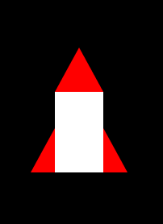
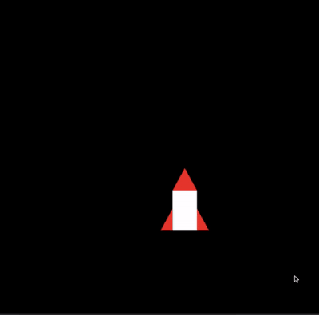
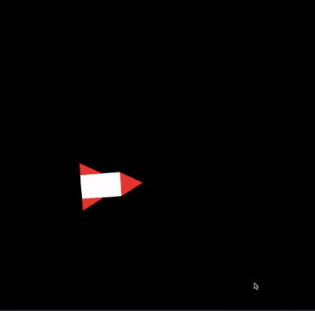
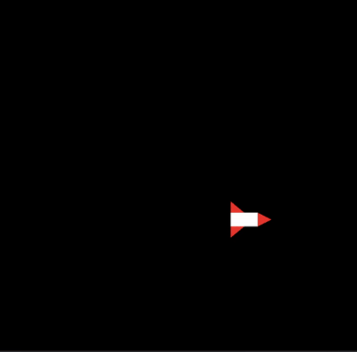
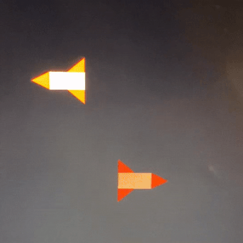
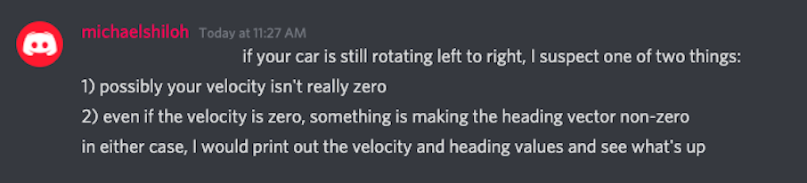
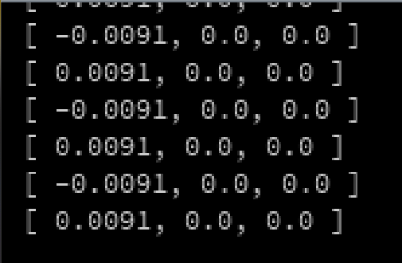
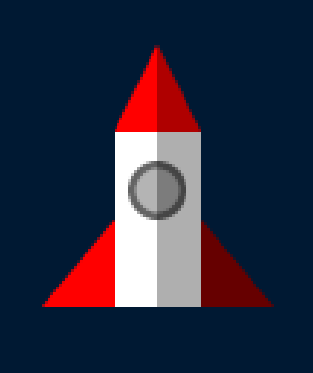
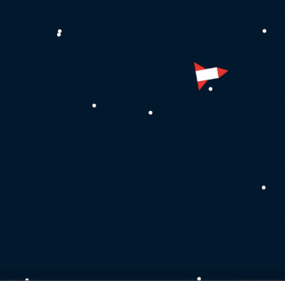

# ROBOTA PSYCHE ASSIGNMENT 1: Moving Rocket Arrow Keys

My project for this week made use of a rocketship drawn on Processing, that detects pressing of the arrow keys to move and rotate in a realistic fashion using velocity, acceleration, and friction.

## PROCESS

When first starting off, I had to create a rough version of what the rocketship would look like. Although using images would have made it look nicer, I stuck to using Processing shapes to show my effort. I made the tails and top red, while adding a white middle.

After this was finished, it was time to get coding.

## SETBACKS

Although this seemed to be a fairly simple assignment, the various factors that affect the rocket's movement is more than what I thought. I ended up spending three whole days working on this project from start to making this documentation. Some of my setbacks are as follows:

### Movement

After inputting the arrow key detection function, what was needed was to make the rocket face the proper direction. However, this did not end up being successful for me, as it would turn in various directions as I was simply reflecting the drawing instead of rotating it.

In addition, after adding the acceleration function, I tried commenting out *acceleration.mult(0)*, as the instructions said it should get faster the longer your press the key. However, this led to my rocket never being able to stop.

### Rotation

After getting feedback from Professor that we had to use the rotate function, I studied how to make it look realistic and tried to make it turn as I pressed left or right. Though slightly successful, I had to use constraints for the angles so it would properly face the right or left. I knew there was an easier way to do this.

    void display() {
        if (rightDirection == true) {
        rotate(velocity.heading()+90);
        } else if (leftDirection == true) {
        rotate(velocity.heading()-90);
        }
      }

After getting help from my classmates, I found the solution to both the movement and rotation problem, which was to put the arrow detection function inside the *DRAW* function instead of inside the *CLASS*. This was very interesting to me because we didn't do that in class. Now, my rocket was looking more realistic.

### Slowing Down and Stopping

There was still one more problem I could not fix: stopping the rocket completely. My classmate and I both struggled with the object glitching when in a completely zero state.

After getting feedback from Professor that it may be due to not having a completely zero acceleration, I tried printing every vector that affected acceleration. Low and behold, the friction function was the one causing it, as it multiplies a value added to acceleration by (-1).

Realizing this, I then created a boolean function that would tell the acceleration to only add the direction if the key is pressed. If not, then it triggers the friction function. Though this was slightly successful, the rocket now still keeps on moving, but very minimally. Unfortunately, this is not something I was able to fix, but Professor said it was okay because rockets constantly move in space anyway. Yay!

      if (keyPressed == false) {
        move = false;
        PVector stop = rocket.velocity.copy();
        stop.mult(-1);
        stop.normalize();
        stop.mult(0.1);
        rocket.drive(stop);
      }

## FINAL TOUCHES

Now having time to add finishing touches to my work, I then added more details to my rocket such as a shadow and a window, as well as added a moving background of stars to make the rocket looks like it's truly in space.

