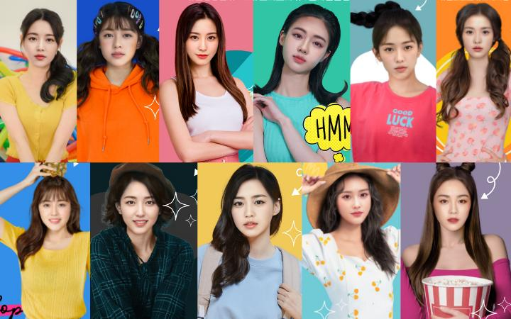

## FINAL PAPER

The discussions we have been having in class has gotten me very curious about the role in robots/artificial intelligence on the future of humans. I currently believe that technology is humans' best friend and worst enemy. I would like to write a paper about how robots and machines are currently portrayed in popular media (movies, TV shows, etc.) and where such thinking came about. 

I also want to delve into the possible benefits and dangers of having AI take over the entertainment industry, delving into the concept of the "uncanny valley effect", or the discomfort we feel when something unhuman is on the brink of looking human. I have recently read about this newly debuted K-Pop group called Eternity that consists of all AI members and songs sung by machines. Though very wary of it in the beginning due to its strange nature, I realized the possible benefit of safety this could bring to idols.

Nowadays, there has been a rise of "deepfake", wherein a celebrity's face is put on the body of another human. This has been used mostly for sexual and pornographic purposes, a disgusting cost of fame. This may cause scars of trauma amongst those whose face was used without their consent. However, if AI begins to slowly replace the entertainment industry, this could remove this fear.

