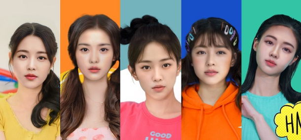
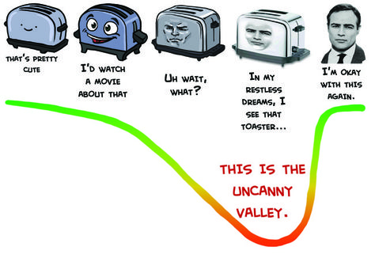
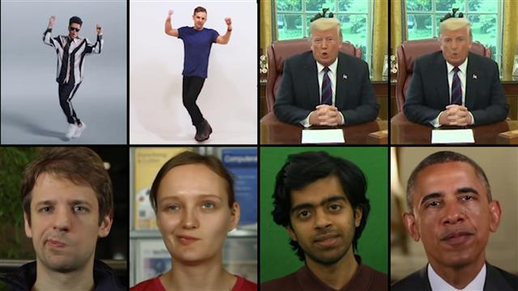
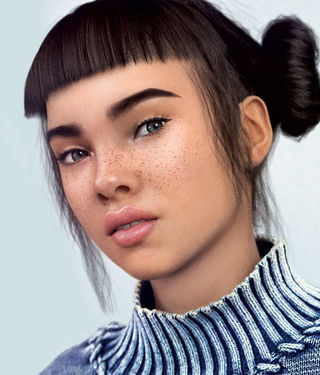
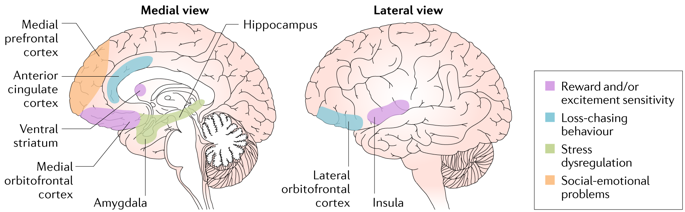

# JOURNAL

## SHORTCUTS
[Day 1](journal.md#day-1), [Day 2](journal.md#day-2), [Day 3](journal.md#day-3), [Day 4](journal.md#day-4), [Day 5](journal.md#day-5), [Day 6](journal.md#day-6), [Day 7](journal.md#day-7), [Day 8](journal.md#day-8), [Day 9](journal.md#day-9), [Day 10](journal.md#day-10)

##### day-1
## DAY 1: APRIL 14 (AI In Entertainment)

Today was the first day I researched a topic for my final paper. Form the beginning, I knew that I wanted to focus on Artificial Intelligence in the entertainment industry. Being and avid K-Pop fan, I am constantly updated with articles regarding the newest trends in the Korean music industry. What intrigued me greatly was the potential debut of an all AI-girl group named Eternity. Made up of all computer generated members, voices, and music, they are the beginning of the all digital future we will see in entertainment.

However, after seeing the comments of their first music video, it is filled with negative comments, saying how their voices and inhuman movements made them uncomfortable. Personally, I also felt the same thing. But what phenomena make us feel this way?

**WILL I CHANGE MY PROJECT?** Because I am enjoying researching the current trends of artificial intelligence in the entertainment industry, I do not want to change my project.

---------------------------------------

##### day-2
## DAY 2: APRIL 17 (Humans' Role In AI Safety)

After seeing the negative reactions from others regarding the AI "human-looking" girl group Eternity, I wanted to find reasons as to why this is so. Delving deeper into research, I found the reason behind this is due to the psychological phenomenon called the "uncanny valley" effect, wherein a human feels a discomfort when seeing somethig that looks almost--but not entirely––human.

In addition, I also wanted to bring into my essay the dangers of such artificial intelligence if they end up in the wrong hands. An example of this is the rise of deepfakes: putting one's face on a body that is not theirs. Used for pornographic or political purposes, this caused nothing but negative effects for those made victims.

I want to show how artificial intelligence can be both beneficial and detrimental to humans and how it is our role on how it will be introduced.

**WILL I CHANGE MY PROJECT?** Because I am enjoying researching the current trends of artificial intelligence in the entertainment industry, I do not want to change my project.

---------------------------------------

##### day-3
## DAY 3: APRIL 18 (Beauty Standards)

Another benefit that I had thought of for AI taking over the entertainment industry is our ability to have more flexible beauty standards. Women constantly compare themselves to Instagram models due to their lavish lifestyle and airbrushed beauty. However, the rise of AI influencers and streamers may put an end to the unrealistic beauty standards faced by humans. An example of these is Twitch V-tuber Code Miko, and AI Instagram star Lil' Miquela.

**WILL I CHANGE MY PROJECT?** To be honest, I am wary of how much more of my voice I can contribute to the ongoing conversation about AI. Though very interesting, I feel like I have put all of my thoughts in our past discussions and presentations. I may want to change my project.

---------------------------------------

##### day-4
## APRIL 19 (Project Change?)

I have decided to change my project to be a code instead of a final paper. I thought that, because I took this class to learn more complex Processing, that is what I will do. Building off my intial idea from last week, I began to look for assets for my project. Below are the cats and people that are the main subjects of the code.

Because of the myth of the "black cat bringing bad luck", I decided to change the antagonist from the orange to the black cat. To follow, I made more people assets that will initially be wearing black clothing but, when they realize it causes cats to flee from them, will change to more colorful clothes.

**WILL I CHANGE MY PROJECT?** Looking at the time I have left for this project, I do not think I can finish both in time, so I may have to choose one or the other.

---------------------------------------

##### day-5
## DAY 5: APRIL 21 (Project Change (Again))

Deciding the timeline of doing both projects to be too difficult, I decided to switch back to doing the paper. Because I already had a topic that I wanted to write about, I began searching for scholarly articles and real life examples of AI in popular media to prove the points I am making in my essay.

**WILL I CHANGE MY PROJECT?** Because I am enjoying researching the current trends of artificial intelligence in the entertainment industry, I do not want to change my project.

---------------------------------------

##### day-6
## DAY 6: APRIL 22 (Kayfabe Concept)

One of the points I make in my essay was how virtual influencers would allow comparisons and insecurities in humans to decrease. However, one would think that, due to the ability to control the features and proportions of the avatars, this would cause insecurities to increase, disproving my claim entirely. However, when reading through articles, I found the concept of a kayfabe.

Starting out in professional wrestling, the concept talks about how we perceive certain forms of entertainment as real, even though we know that they aren't--purely for the sake of business or enjoyment. This ties in with having virtual influencers on social media platforms instead: they fulfill the content creation most humans crave, yet is "artificial" enough for humans to be aware not to compare themselves with--they are virtual, after all!

**WILL I CHANGE MY PROJECT?** Because I am enjoying researching the current trends of artificial intelligence in the entertainment industry, I do not want to change my project.

---------------------------------------

##### day-7
## DAY 7: APRIL 24 (Brain and Perception)

While I was scrolling on TikTok, I watched a video about a psychology student learning about the medial prefontal cortex, which is a part of the brain that is able to detect a human or an object. Noticing this could tie in very well with my paper, I began to research more on this part of the brain and see if a brain detects human-like machines as humans or robots.

**WILL I CHANGE MY PROJECT?** Because I am enjoying researching the current trends of artificial intelligence in the entertainment industry, I do not want to change my project.

---------------------------------------

##### day-8
## DAY 8: APRIL 26 (Photos and References)

Today, I began to add photos into my essay and cite the links I referenced. Because some of my links are articles rather than scholarly papers (meaning I couldn't exactly cite the page number in the inline citation), I figured it would look more cohesive if I used APA rather than the normal MLA format. Because of this, I spent some time changing my links from MLA to APA. Thank you Professor for allowing both!

**WILL I CHANGE MY PROJECT?** Because I am enjoying researching the current trends of artificial intelligence in the entertainment industry, I do not want to change my project.

---------------------------------------
