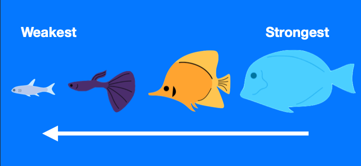
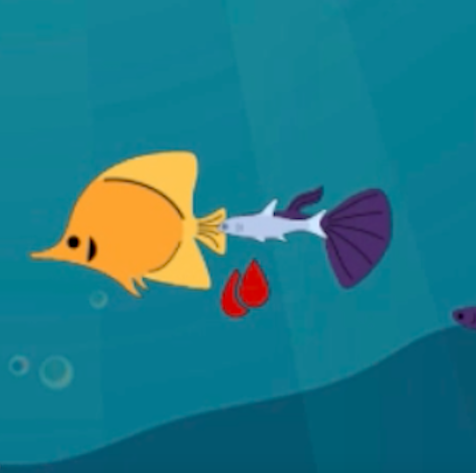
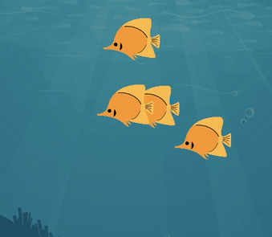
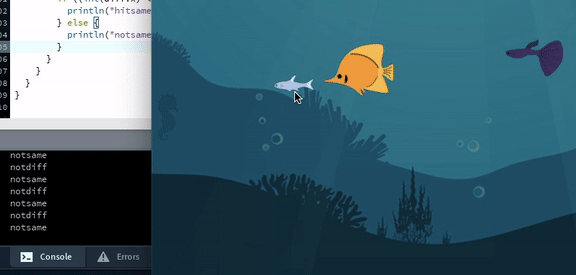
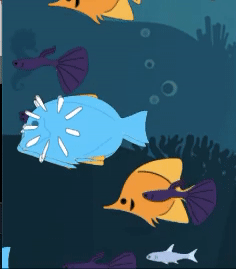
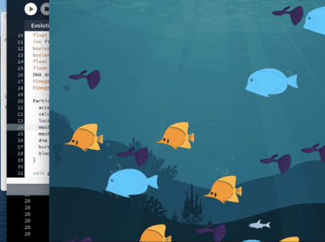
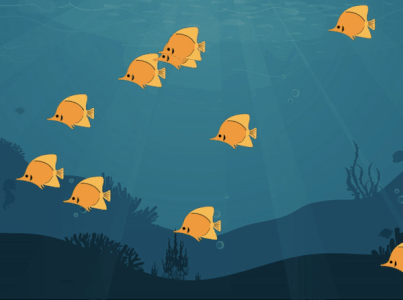

# ROBOTA PSYCHE ASSIGNMENT 4: Sea of Fishes Behavior (Continued)

For this assignment, we were instructed to start implementing forms of DNA and behaviors that will cause adding and subtracting of multiple vehicles. My code, though not doing implementing the behaviors I want yet, creates a lively sea of fish (different colors and sizes) moving in random directions. I want to code it so that, when a small fish comes in close contact with it predator, it will disappear, and when it comes close to a similar fish, will reproduce another fish of that species.

**DISCLAIMER:** This code took me more than 2 full school days to complete. The day I am finishing this now, I worked on this code for 13 straight hours and I'm *still* not fully proud of it.

## WHERE I LEFT OFF

Reworking the code I had from before, I wanted to implement a behavior that makes it so that, when a bigger fish collides with a specific smaller fish, the smaller fish will disappear, indicating that it has been "eaten". A big fish cannot eat any small fish; instead, it can only eat the small fish directly under them in the food chain. The hierarchy is below:

## NEW FEATURES

### 1. Burst And Blood Collision Animation

Originally for my benefit, I coded so that a burst animation would appear whenever two fish of the same species appear, and for blood to appear whenever two fishes of different species (on the hierarchy) would appear.

### 2. Proper Reproduction Animation

## SETBACKS

### 1. Collision Between Objects of the Same Class

I thought that, because the fishes were all from the same class, it would be difficult to figure out how to treat each object as an individual entity. However, from reworking some of Professor's code regarding the separate function, I found out that there is a certain syntax for() loop for this called "for (Particle other : particles)", which allows you to get values from another particle in the same class.

Using this, I calculated the distance between the fishes and put if functions to determine if they should be eaten or not, such as if the difference between the two fish numbers is equal to 1 (indicating their one step above in the food chain) or equal to 0 (indicating they're the same species).

### 2. Fishes Getting Stuck

Sometimes, when fishes of the same species collide, it causes them to stop moving, therefore making the burst animation stay. Unfortunately, I'm not sure how to fix this.

### 3. No Reproduction

Weirdly, when I printed the amount of fish in the ocean, the number of fish would increase very slowly compared to how many bursts I saw on the canvas. After having a back ancd forth conversation with Professor why this may be so, he said that it may be due to me adding my own count of the fish instead of using vehicles.size(). Although, this was not the only problem.

### 4. _IMPROPER_ Reproduction

When I did try to fix the problem of inconsistent reproduction, I managed to get the fishes reproducing; however, it caused it to reproduce A LOT. Professor's suggestion for this was to change it so that it only reproduced over a certain number of frames. This worked, but not in the way that I had hoped.

## COMPLETELY STARTING OVER

Because I was having so many issues with my code and not knowing where it was coming from, I decided that it would be best for my cluttered mind to start over from scratch so I can learn each part. I took some parts from Professor's code and reworked them accordingly. I was able to get the production animation to finally work properly and reproduce slowly.

### UPSIDE: Reproduction Based on Species! :)

Because I was successful in properly reproducing the fishes, I was able to move on to my next problem, which was to reproduce the fish only of that spedies when they collided. Fortunately, I was able to do this!

### DOWNSIDE: No More Eating Animation :(

Unfortunately, a downside to this was that I could no longer input an eating animation because it would have to make use of an interator, which deleted the vehicles faster than what I would have liked. To substitute, I made it so that the vehicles die when they move out of the canvas.
