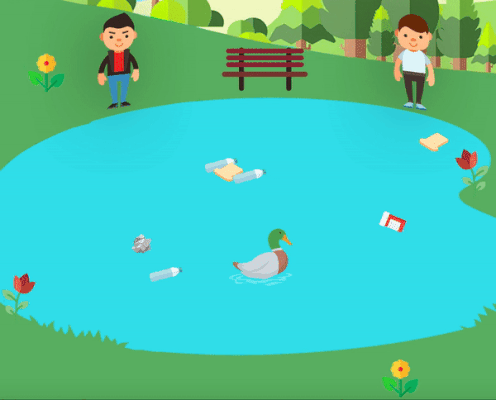
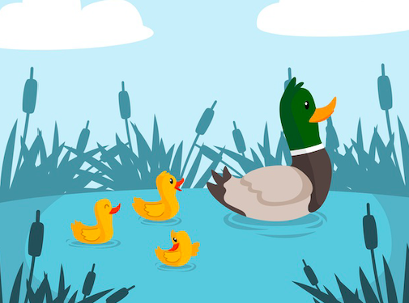
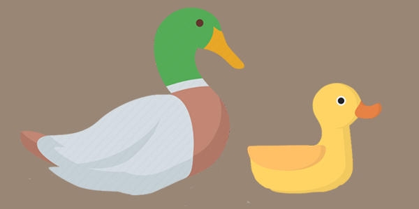
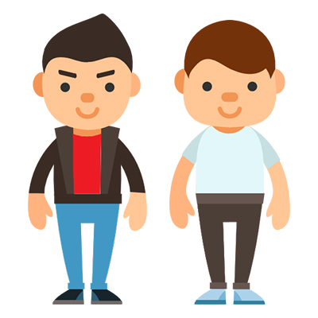
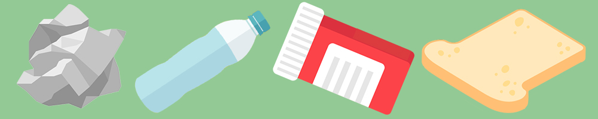
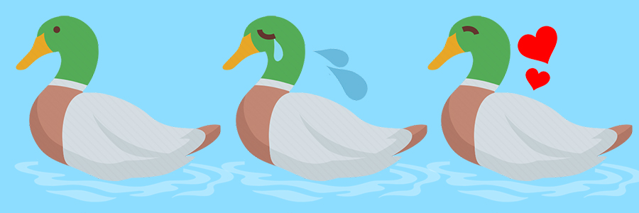
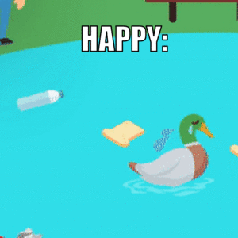
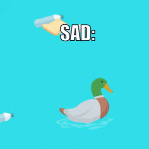

# ROBOTA PSYCHE ASSIGNMENT 5: Duck, Trash, and Bread

For this assignment, we were instructed to finish our project from March 1st. I had my fish ecosystem project, where, if two fish of the same species collided, they would reproduce a fish of the same species. However, I was having difficulties with the fact that the fishes would reproduce more than once.

I have spent *countless* days trying to debug and talk with Professor about my problems, but I couldn't find a solution to it. So, for the sake of my mental health, I decided ot create a whole new project in inspiration to my previous project (I ended up finding the solution to my fish ecosystem while creating the new project but more on that later!)

## SUMMARY

My new project consists of a duck in a pond that you control with the arrow keys. In the background, we see two boys. The rowdy boy on the left throws trash and the good boy on the right throws bread. Your goal is to direct the duck towards the bread while avoiding the trash. If you eat the trash, the duck gets sick. If he eats bread, he turns happy.

## INSPIRATION

I actualy first wanted to create an ecosystem similar to my first project. I would gather older ducks and ducklings and they would swim around in the pond, maybe even the ducklings following the duck.

I gathered images from the internet to use: however, when I began to think about it, what would the ducks and ducklings do? Just swim? I wanted to put something more. I ended up abandoning this idea and decided to do something like ducks swimming towards bread to eat it. However, it didn't look as realistic as I would like.

## FEATURES

The features of my project are as follows:

### 1. Good Boy & Rowdy Boy

Because I needed a back story as to why there was pieces of trash and bread being thrown around in the pond, I decided to put two boys in the background to make it look like they're the ones throwing it. I actually originally made it so that, when you liked the rowdy boy, he would throw a trash, and if you clicked the good boy, he would throw the bread. However, when I thought about it, if the player's goal is to make the duck eat bread, they'll never click the rowdy boy! I decided to remove this feature.

### 2. Eating Trash & Bread

Because I wanted to do something related to ducks, I immediately thought of bread being thrown in the water, because the random flow field gives a movement similar to water. I got a PNG file of a piece of bread, but I thought it was too boring if it's just bread alone. With this said, I gathered different pieces of trash the duck has to avoid.

### 3. Duck States

When I created the function to make the trash and bread disappear when the duck "eats" it, I wanted to make some states of the duck to make it obvious to the player that they ate a piece of trash or bread. I edited the duck looking sick and happy to signify if it ate trash or bread respectively.

## SETBACKS IN CODE

### 1. Producing More Than One Piece of Trash

Because I coded my project so that a random piece of trash would appear in the water every two seconds, this was a similar problem I had with my first fish project. Weirdly, I was able to debug this problem in my new project compared to the fish project, so I technically solved the problem on my first project!!! 

When I was closely observing what was causing this, I realized that the add Vehicle function was inside a For Loop that added new vehicles in the number of the vehicle size!

    for (int i = vehicles.size()-1; i>=0; i--) {
    if (frameCount % 200 == 0) {
          vehicles.add(new Vehicle(random(50, 850), random(300, 550)));
        }
      }

Because of this, it would create numerous new vehicles even though I only wanted one. I solved this by creating a new For Loop that only added one Vehicle.

    for (int i = 0; i < 1; i++) {
        if (frameCount % 200 == 0) {
          vehicles.add(new Vehicle(random(50, 850), random(300, 550)));
        }

This was an absolute winner for me, because I don't know what I would have done if I wasn't able to solve this!

### 2. Changing State of Duck Depending On What It Eats

Though changing the state/face of the duck depending on what it eats was a feature I wanted to add since the beginning of this project, I hesistated from doing it because it involved getting information from the Main file. However, it was less intimidating than what I expected.

In the Duck file, I set a display function that would show the respective emotion depending on what the duck eats (simplified for the sake of the readme):

    void display(int trashnumber) {
      if (trashnumber == 0 || trashnumber == 1 || trashnumber == 2) {
        image(sickduck);
      } else if (trashnumber == 3) {
        image(happyduck);
      } else {
        image(normalduck);
      }
  
  
  
  
In the main file, I coded it so that, when a specific vehicle was "eaten" by the duck, it would get the number of the trash (0-2 is trash, 3 is bread):

    if (v.isDead()) {
          trashnumber = vehicles.get(i).trashnumber;
          vehicles.remove(v);
        }
        
In addition, in draw(), I applied the display() function from the Duck class and sent the trashnumber from the code above:

    d.display(trashnumber);
